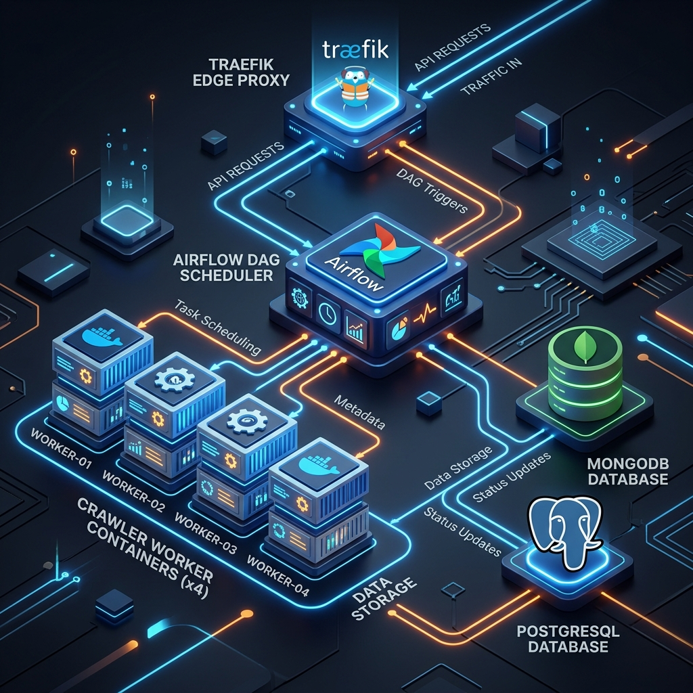

# 🌐 News Collection for RAG

TDD(Test-Driven Development)와 확장 가능한 아키텍처를 기반으로 구축된 AI 및 기술 뉴스 수집 플랫폼입니다. `uv`, `Scrapling`, `Airflow`, `Docker Compose`를 사용하여 견고한 데이터 파이프라인을 제공합니다.

## 시스템 아키텍쳐



```text
==============================================================================
                    GEEKNEWS CRAWLER SYSTEM ARCHITECTURE
==============================================================================

                          [ External Users ]
                                  │
              ▼ (af.localhost, pg.localhost, kasm.localhost)
                      ┌───────────────────┐
                      │  Traefik Proxy    │ (Edge Gateway)
                      └─────────┬─────────┘
                                │
    ┌───────────────────────────┴────────────────────────────┐
    │              Docker Network: crawler_default           │
    └────────┬──────────────────┬───────────────────┬────────┘
             │                  │                   │
             ▼                  │                   ▼
     ┌─────────────┐            │            ┌─────────────┐
     │ Airflow Web │            │            │  Kasm (VDI) │
     └──────┬──────┘            │            └─────────────┘
            │                   │
            │           ┌───────▼───────┐
            │           │  Airflow Sch  │ (Scheduler)
            │           └───────┬───────┘
            │                   │
            │                   │ 🚀 (1) Trigger via /var/run/docker.sock
            │                   │
            │                   ▼
            │           ┌───────────────┐
            │           │    Worker     │ (Ephemeral Unit)
            │           └───────┬───────┘
            ▼                   │ 💾 (2) Save Scraped Data
     ┌─────────────┐            ▼            ┌─────────────┐
     │  PostgreSQL │            ─────────────▶   MongoDB   │
     │ (Meta Data) │                         │  (Scraped)  │
     └──────┬──────┘                         └──────┬──────┘
            │                                       │
     ───────┼───────────────────────────────────────┼───────
            ▼                                       ▼
     ┌─────────────┐                         ┌─────────────┐
     │  Volume:    │                         │  Volume:    │
     │  /postgres  │                         │  /mongodb   │
     └─────────────┘                         └─────────────┘

==============================================================================

```

```text
==============================================================================
                  [2] KASM INTERACTIVE MANAGEMENT FLOW
==============================================================================

      [ Developer Access ]
              │
              ▼ (kasm.localhost)
      ┌───────────────────┐
      │  Traefik Proxy    │
      └─────────┬─────────┘
                │
    ┌───────────┴────────────────────────────────────────┐
    │          Docker Network: crawler_default           │
    └──────────────────────────┬─────────────────────────┘
                               │
              ┌────────────────┴────────────────┐
              │       Kasm (VDI Workspace)      │
              │  ┌───────────────────────────┐  │
              │  │  💻 VS Code (Dev)         │──┼──▶ [ Code/Debug ]
              │  │  🐘 DBeaver (SQL)         │──┼──▶ [ PostgreSQL ]
              │  │  🍃 Mongo-Comp (NoSQL)    │──┼──▶ [ MongoDB    ]
              │  │  🌐 Chrome (Web UI)       │──┼──▶ [ Airflow UI ]
              │  └───────────────────────────┘  │
              └─────────────────────────────────┘

==============================================================================

```

1.  **Entry Point**: 최상단의 `External Users`가 `Traefik` 프록시를 통해 시스템에 접속합니다.
2.  **Shared Network**: 모든 서비스가 소속된 가상 네트워크를 통해 상호 통신합니다.
3.  **Control Center**: `Airflow`가 시스템의 중심에서 크롤링 태스크를 스케줄링하고 워커를 트리거합니다.
4.  **Kasm (VDI)**: 브라우저 기반 GUI 개발 환경을 제공하여 데이터 확인 및 코드 수정을 인터랙티브하게 수행할 수 있습니다.
5.  **Persistence Layer**: 컨테이너가 삭제되어도 데이터가 유지되는 호스트의 `Volume` 영역을 활용합니다.


## 🚀 주요 특징

- **Multi-Source Strategy**: `BaseScraper` 추상 클래스와 Registry 패턴을 통해 신규 뉴스 소스를 유연하게 추가합니다.
- **TDD 기반 품질 보증**: `pytest-vcr`과 Golden Record 방식을 사용하여 네트워크 의존성 없는 테스트를 수행합니다.
- **강력한 수집 능력**: `Scrapling`의 Stealth 모드를 통해 봇 탐지를 우회하며 상세 페이지까지 심층 수집합니다.
- **안정적인 오케스트레이션**: `Apache Airflow`를 통해 수집 스케줄링 및 Backfill을 관리합니다.
- **데이터 무결성**: `Pydantic` 모델 검증과 MongoDB Upsert 로직을 통해 데이터 멱등성을 보장합니다.

## 🛠 기술 스택

- **Language**: Python 3.12
- **Package Manager**: `uv`
- **Scraping**: `Scrapling`, `BeautifulSoup4`
- **Orchestrator**: `Apache Airflow` (v2.10+)
- **Database**: `MongoDB`, `PostgreSQL` (Metadata)
- **Infrastructure**: `Docker Compose`, `Traefik` (v3.6+), `Kubernetes` (Testing)

## 📂 프로젝트 구조

```text
.
├── app/                    # 크롤러 애플리케이션 소스
│   ├── main.py             # 진입점
│   ├── models.py           # Pydantic 데이터 모델
│   └── scrapers/           # 소스별 스크레이퍼 구현체
├── dags/                   # Airflow DAG 정의
├── docker/                 # 모듈형 인프라 설정
│   ├── services/           # 서비스별 Dockerfile 및 설정
│   │   ├── airflow/        # Airflow 모듈
│   │   ├── kasm/           # Kasm VDI 모듈
│   │   ├── kubernetes/     # K8s 테스트 환경 모듈
│   │   ├── mongo/          # MongoDB 모듈
│   │   └── traefik/        # Traefik 프록시 모듈
│   ├── compose.crawler.yml # 메인 인프라 진입점
│   └── compose.kubernetes.yml # K8s 환경 진입점
├── scripts/                # 테스트 데이터 생성 유틸리티
├── tests/                  # 유닛 테스트 및 샘플 데이터
├── Makefile                # 통합 관리 명령어
└── compose.yml             # 기본 실행 설정 (include 기반)
```

## ⚙️ 설치 및 실행

### 1. 기본 인프라 실행 (Crawler Stack)
```bash
make up
```

### 2. Kubernetes 테스트 환경 실행
```bash
make up PRJ=k8s
```

### 3. 주요 관리 명령어 (Makefile)
- **테스트 실행**: `make pytest`
- **로컬 수집 테스트**: `make test SOURCE=GeekNews DATE=YYYY-MM-DD`
- **데이터 백필**: `make backfill START_DATE=... END_DATE=...`
- **상태 확인**: `make ps` 또는 `make top`
- **K8s 전용**: `make k8s-status`, `make k8s-init`, `make k8s-join`

## 🧪 개발 워크플로우 (TDD)

1. **Model & Test**: 모델 정의 및 실패하는 테스트 작성.
2. **Green Logic**: 최소한의 파싱 로직 구현.
3. **Golden Record**: 실제 데이터를 JSON 기대값으로 저장.
4. **Refactor**: 코드 최적화 및 추상화.
5. **Deploy**: Airflow DAG 반영 및 실행 확인.

## 📝 라이선스
[LICENSE](./LICENSE) 파일을 참조하십시오.
